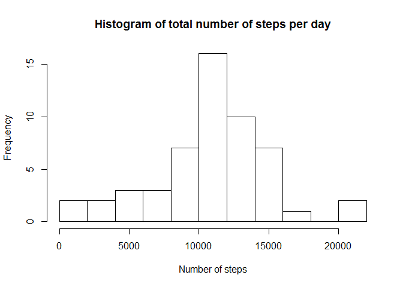
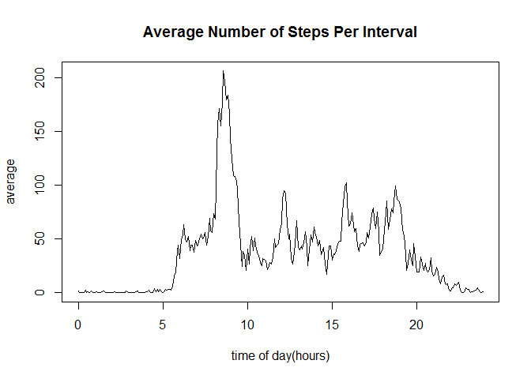
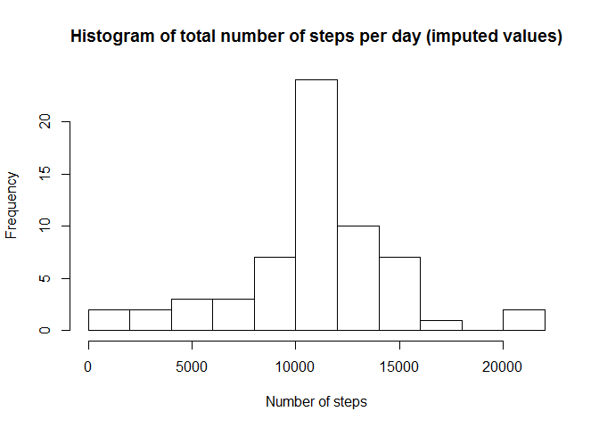
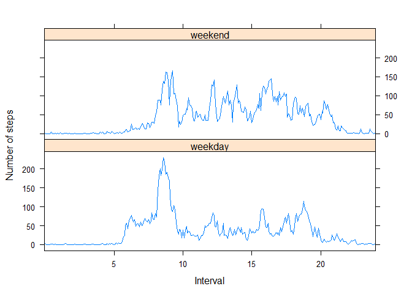

# Reproducible Research: Peer Assessment 1


## Loading and preprocessing the data

```r
library(lattice)
unzip("activity.zip",exdir="PA1")
raw<-read.csv("PA1/activity.csv")

#add factor variable for intervals in hours 
raw$time <- as.factor(raw$interval)
#convert levels to POSIXt and then to intervals in hours (decimalized)
n <- as.integer(levels(raw$time))
t <- paste( n%/%100, n-100*n%/%100, sep=":")
t<- strptime(t,format="%H:%M")
origin <- rep(t[1],length(t))
levels(raw$time) <- difftime(t,origin,units="hours")

#ignore rows whose steps value is missing
data<-raw[!is.na(raw$steps),]

#rebuild levels of factor vector using only dates that had no missing steps values
data$date <- as.factor(as.Date(data$date))
```

## What is mean total number of steps taken per day?

```r
total <- with(data,tapply(steps,date,sum))
hist(total,main="Histogram of total number of steps per day",breaks=10,xlab="Number of steps")
```

 

```r
meanSteps <- mean(total)
medianSteps <- median(total)
```
The mean number of steps taken each day is 1.0766189\times 10^{4} and the median is 10765.  

## What is the average daily activity pattern?

```r
y <- with(data,tapply(steps,time,mean))
plot(names(y),y,type="l",xlab="",ylab="")
title(main="Average Number of Steps Per Interval",xlab="time of day(hours)",ylab="average")
```

 

```r
maxtime <- t[which(y==max(y))]
prnttime <- paste(maxtime$hour,maxtime$min,sep=":")
```
The maximum average number of steps over all days occurs at the interval starting at 8:35.  

## Imputing missing values
Missing steps values are replaced by the mean number of steps for the corresponding interval.

```r
#calculate the number o f NAs
numNAs <- length(raw$steps[is.na(raw$steps)])
# create new data frame and replace missing steps values with the mean value for that interval
imputed <- raw
for(i in 1:length(raw$steps)){
        if (is.na(raw$steps[i]) & i%%288 == 0) {
                imputed$steps[i] <- y[288]
        }
        else if (is.na(raw$steps[i])) {
                imputed$steps[i] <- y[i%%288]
        }
        else {
                imputed$steps[i] <- raw$steps[i]
        }
}
newtotal <- with(imputed,tapply(steps,date,sum))
hist(newtotal,main="Histogram of total number of steps per day (imputed values)",breaks=10,xlab="Number of steps")
```

 

```r
mean(newtotal)
```

```
## [1] 10766.19
```

```r
median(newtotal)
```

```
## [1] 10766.19
```
The number of missing values is 2304.
The mean of the total number of steps over all days, including imputed values is 1.0766189\times 10^{4}. The mean of the total number of steps, ignoring days with missing values is 1.0766189\times 10^{4}. The absolute change in the means is 0.
The median of the total number of steps over all days, including imputed values is 1.0766189\times 10^{4}. The mean of the total number of steps, ignoring days with missing values is 10765. The absolute change in the medians is 1.1886792.
The mean and median have become equal after imputing missing values, implying that the distribution has become more symmetric.  

## Are there differences in activity patterns between weekdays and weekends?

```r
days <- weekdays(as.Date(imputed$date))
wdays <- sapply(days,function(day) 
        if(day=="Saturday"| day=="Sunday"){
                day <- "weekend"
                }
        else{
                day<-"weekday"
                })
wdays <- as.factor(wdays)
imputed$wdays <- wdays
#build data frame with data for panel plot
panels <- split(imputed,wdays)
meanWEnd <- tapply(panels$weekend$steps,panels$weekend$time,mean)
meanWDays <- tapply(panels$weekday$steps,panels$weekday$time,mean)
means <- c(meanWEnd,meanWDays)
x <- rep(unique(imputed$time),2)
days <- c(rep("weekend",288),rep("weekday",288))
paneldata <- data.frame(x,means,as.factor(days))
xyplot(means~x|days,paneldata,xlab="Interval",ylab="Number of steps",type="l",layout=c(1,2),scales=list(x=list(at=c(x[0],x[61],x[121],x[181],x[241]))))
```

 
